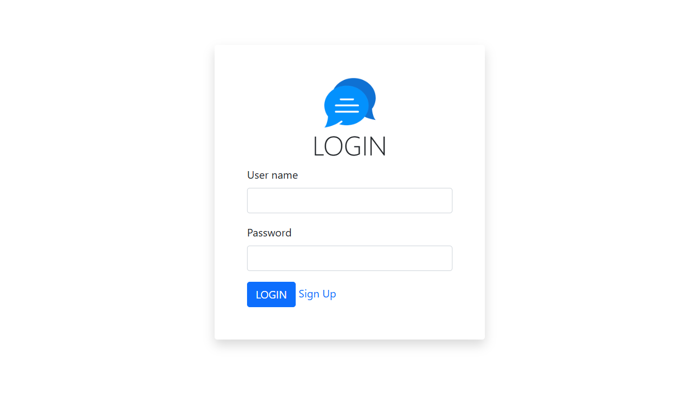
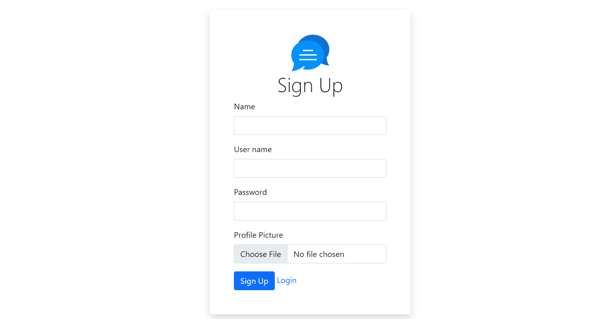
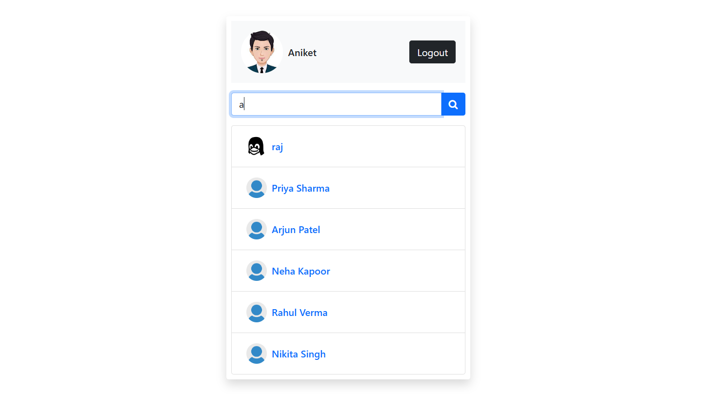
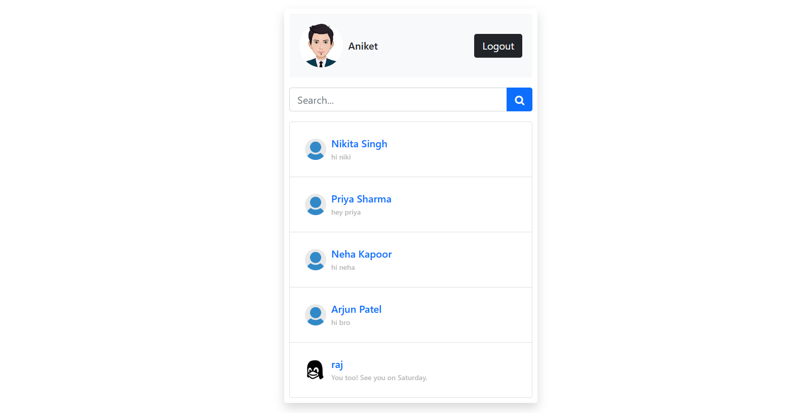
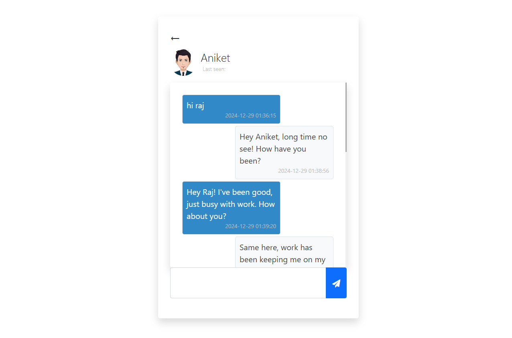
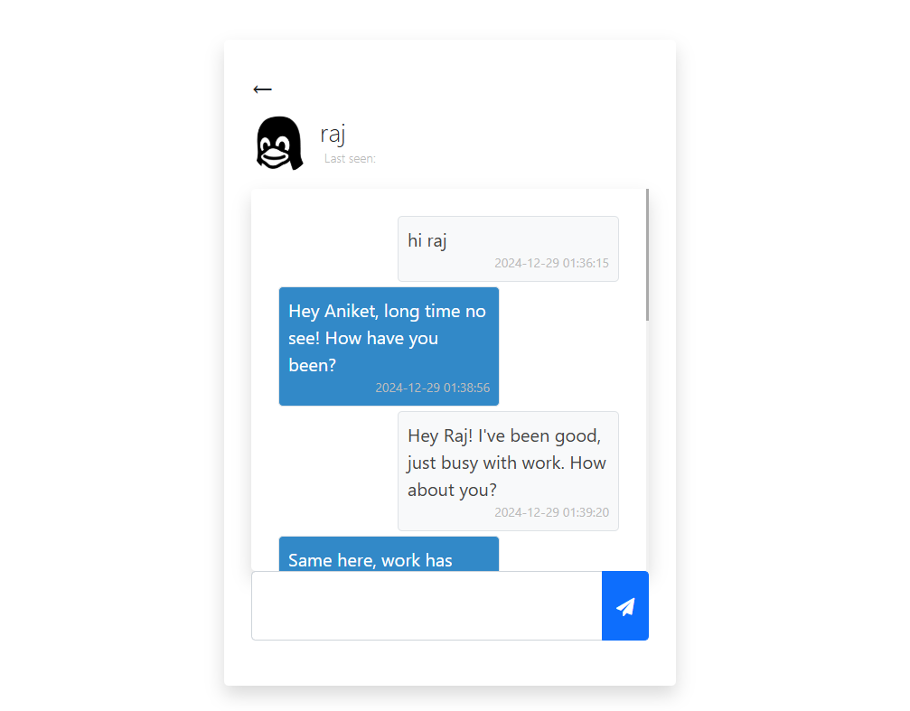

# PHP Chat App

A real-time chat application built using PHP, MySQL, jQuery, Bootstrap, HTML, and CSS.

## Description

This project is a simple chat application that allows users to communicate in real-time. It's built using PHP for the backend, MySQL for data storage, and jQuery for AJAX-based communication. Bootstrap is used for styling the front end.

## Required Tools and Technologies

- **Programming Language**: PHP, JavaScript (jQuery)
- **Database**: MySQL
- **Libraries/Dependencies**:
  - Bootstrap
  - jQuery
- **Development Tools**:
  - XAMPP or any other PHP development environment with MySQL support
  - Code editor (e.g., Visual Studio Code, Sublime Text)
- **Platform**: Web

## Installation

To get this chat app up and running, follow these steps:

1. Clone the repository:
   \`\`\`bash
   git clone https://github.com/guru9696/php-chat-app.git
   \`\`\`

2. Move the project folder to \`htdocs\` of your XAMPP installation:
   \`\`\`bash
   mv php-chat-app C:/xampp/htdocs/
   \`\`\`

3. Set up the MySQL database: 
- Copy the \`.sql\` file to the \`db\` directory of your project. 
- Open **phpMyAdmin** via XAMPP. 
- Create a new database called \`chat_app\`. 
- Go to the **Import** tab. 
- Click the **Choose File** button and select the \`chat_app_db.sql\` file from your project directory (e.g., \`php-chat-app/db/chat_app_db.sql\`). 
- Click the **Go** button to import the database..

   

4. Start the Apache and MySQL servers using the XAMPP Control Panel.

5. Open your browser and navigate to \`http://localhost/php-chat-app/index.php\` to see the chat app in action.

## Usage

1. Open the application in your browser.
2. Enter your username and join a chat room.
3. Start chatting with other users in real-time.

## Screenshots

### Login Page

### Sign Up Page

### Search Friend 

### Chat Room

### Raj Room Example

### Aniket Room Example

## License

This project is licensed under the MIT License.

